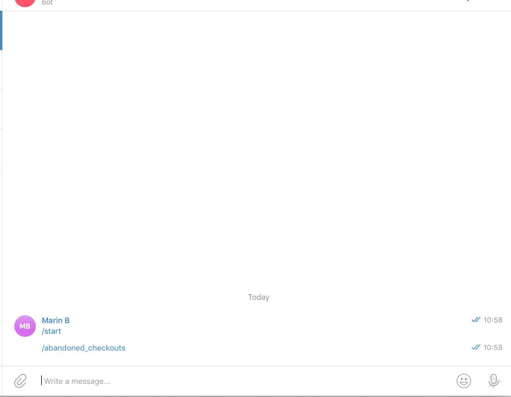

# Shopify Telegram Bot for Admins

[](LICENSE)



## Setup

- Generate shopify private app token and password
- Create Telegram Bot and save telegram bot token
- Configure (next section)

## Configuration
### Copy `.env.example` to `.env`

| Value  | Type  | Default  | Description  |
|---|---|---|---|
| APP_DEBUG  | bool  | true  | Shows more information on console  |
| APP_KEY  | string  | none  | Shopify API Key  |
| APP_PASSWORD  | string  | none  | Shopify API password  |
| SHOP_NAME  | string  | none  |  Shop name without .myshopify.com |
| TELEGRAM_TOKEN  | string  | none  | Telegram Token when you create a bot  |


## Commands

| Command  | Arguments  | Example  | Description  |
|---|---|---|---|
| /abandoned_checkouts  | none  | /abandoned_checkouts  | Shows count of abandoned checkouts  |
| /orders  | none  | /orders  | Shows count of any orders  |
| /orders  | status  | /orders shipped  | Shows count of orders by fullfilment status, available args are: shipped,partial and unshipped. |
| /payments  | none  | /payments  | Shows total amount of any financial status all dates  |
| /payments  | status  | /payments paid | Shows total amount for paid orders, all dates |
| /payments  | status, days  | /payments paid -7 | Shows total amount for paid orders, last 7 days |


## Building
```sh
go build
```

## Running
```sh
./shopify-telegram-bot
```


## License
MIT

## Author
Hartt Media 
